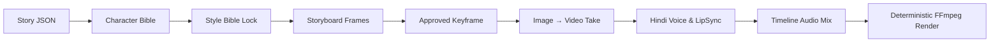

<div align="center">

# 🎬 OpenStory Studio

### The Open-Source AI Filmmaking Suite for Cinematic Animated Stories with Strict Character Consistency

[](LICENSE)
[](https://nextjs.org/)
[](https://www.typescriptlang.org/)
[](https://www.prisma.io/)
[](https://ffmpeg.org/)
[](CONTRIBUTING.md)

<p align="center">
  <b>Stop generating random 5-second video clips that look like completely different people.</b><br/>
  OpenStory Studio brings professional filmmaking architecture to Generative AI: Decompose narratives into shot plans, lock character bibles, approve keyframes, synthesize natural Hindi voices, and deterministically assemble master films with auto-ducked music and hardcoded Devanagari subtitles.
</p>

> **🌟 Starting Scope & Expansion Roadmap**:  
> OpenStory Studio launches with dedicated, battle-tested support for **authentic Hindi storytelling** (Devanagari script, regional folklore, mythological epics, moral fables) and **Stylized 3D Animation** (Octane render aesthetic, rich cultural environments, subsurface scattering). We are actively expanding to support **additional regional Indian & global languages** (Tamil, Telugu, Bengali, Marathi, English) and **diverse visual styles** (Anime, 2D Classic, Watercolor, Cyberpunk)!

[Quick Start](#-quick-start) • [The Filmmaking Pipeline](#-the-filmmaking-pipeline) • [Free Web ($0) vs API Mode](#-two-ways-to-create-free-web-vs-direct-api) • [Architecture](#-architecture) • [Product Hunt & LinkedIn Kit](#-launch-kit)

</div>

---

## 💡 Why OpenStory Studio?

Generative AI video models (Kling, Runway, Hailuo, Sora) can produce breathtaking visuals. But trying to create a coherent story with a single prompt fails because:
1. **Characters change appearance** in every cut (different faces, clothing, skin tones).
2. **Audio is desynchronized** or lacks native language inflection.
3. **API costs explode** if you regenerate entire multi-shot videos repeatedly.

**OpenStory Studio solves this by enforcing the real filmmaking pipeline:**



---

## ✨ Core Features

| Feature | Description |
| :--- | :--- |
| 👤 **Persistent Character Bibles** | Define and lock character traits (facial structure, skin tone, hair, clothing, accessories). Every generated shot inherits these tokens. |
| 🎨 **Style Bible Locking** | Project-wide visual grammar (3D stylized animation, Indian environments, lighting, lens types, depth of field, negative constraints). |
| 🤖 **1-Click AI Story Planning** | Generate structured story JSON with configured OpenAI, Anthropic, Google Gemini, or OpenRouter credentials, or use the free copy-paste prompt flow. |
| 🎙️ **Solo Storyteller (कथावाचक) Mode** | The supported first-release audio workflow: one coherent narrator track across the story. Multi-character dialogue sequencing is on the roadmap. |
| 🖼️ **Shot-by-Shot Image Studio** | Generate 3–8 second scenes individually. Approve candidate takes and promote them to **Approved Production Frames** before animating. |
| 🎥 **Image-to-Video Engine** | Animate approved frames with controlled camera movements (*Slow Dolly In*, *Pan*, *Tilt*, *Orbit*) and motion dynamics via **Kling AI** & **Seedance**. |
| 🎙️ **Hindi Voice Lab** | Native Hindi TTS powered by **Sarvam AI (`bulbul:v3`)** & **ElevenLabs**. Automatic number-to-Devanagari translation, currency conversions, and pronunciation dictionaries. |
| 👄 **Video Lip Sync** | Automated character lip sync via **SyncLabs** with a built-in local FFmpeg fallback for dialogue scenes. |
| 🎚️ **Timeline Audio Mix & Ducking** | Mix active narration/dialogue with project music and automatically lower music during speech. Full interactive five-stem mixing remains roadmap work. |
| 📝 **Devanagari Subtitle Burner** | Generates scene-timed SRT/VTT subtitles and can burn readable Hindi captions into the video stream. Word-level alignment remains roadmap work. |
| 🎞️ **Deterministic FFmpeg Export** | Multi-track concatenation engine with 4 presets: **YouTube 1080p**, **Cinematic 4K**, **Shorts 9:16**, and **Fast Preview**. |
| 📦 **1-Click Full Project Portability (.zip)** | Export and import entire video projects as self-contained `.zip` archives containing all scene prompts, camera motion specs, character bibles, and all local media files (images, audio voiceovers, video clips). Zero vendor lock-in. |

---

## 🆓 Two Ways to Create: Free Web ($0) vs. Direct API

OpenStory Studio is designed to respect your budget. You can choose how to generate your media:

### 1. 🌟 Free Web Mode ($0 Spend — No API Keys Needed)
Take advantage of generous daily free web tiers with built-in **1-click launcher buttons** right beside the Copy Prompt and Upload buttons:

| Modality | Top Free Alternatives Integrated | Quota / Perk |
| :--- | :--- | :--- |
| 🖼️ **Portraits & Frames** | [Google ImageFX](https://aitestkitchen.withgoogle.com/tools/image-fx), [Copilot Designer](https://copilot.microsoft.com), [SeaArt (Flux)](https://www.seaart.ai), [Leonardo.ai](https://leonardo.ai) | 100% Free / Daily Fast Tokens |
| 🎥 **Image-to-Video** | [Kling AI Web](https://klingai.com), [Hailuo AI](https://hailuoai.video), [Luma Dream Machine](https://lumalabs.ai/dream-machine), [PixVerse AI](https://pixverse.ai) | **66 Free Credits/Day**, Cinematic Motion |
| 🎙️ **Hindi Voiceover** | [Sarvam AI Playground](https://sarvam.ai), [ElevenLabs Free](https://elevenlabs.io), [TTSFree (Edge Hindi)](https://ttsfree.com) | Authentic Hindi Accents, 10k Chars/mo |

- **How it works**: Click **"Copy Prompt"** → Click the launcher button to open the free generator in a new tab → Download your asset → Click **"Upload"** into OpenStory Studio.
- **OpenStory Studio handles the rest**: Multi-track timeline sequencing, sidechain soundtrack ducking, Devanagari subtitles, and deterministic FFmpeg exports!

### 2. ⚡ Direct API Mode (Programmatic Speed)
Configure API keys in the **Settings** page for one-click automated generation:
- **Story Planning**: OpenAI, Anthropic, Google Gemini, OpenRouter
- **Audio / TTS**: Sarvam AI, ElevenLabs
- **Images**: Google Gemini image generation, FLUX, OpenAI GPT Image
- **Video**: Kling AI, Seedance
- **Lip Sync**: SyncLabs

---

## 📦 Full Video Project Portability (1-Click ZIP Export & Import)

Never worry about cloud lock-in, data loss, or server migrations. OpenStory Studio includes **full project bundling**:

- **1-Click Export (.zip)**:
  - In your studio dashboard or project header, click **"Export Project (.zip)"**.
  - Bundles the complete database schema (`project.json`), all scene prompts, camera motion presets, Devanagari Hindi voice tracks, character bibles, AND all locally downloaded or generated media files (`images/`, `videos/`, `narration/`, `dialogue/`, `music/`, `sfx/`, `renders/`) into a single portable archive.
- **1-Click Restore (.zip)**:
  - On any machine running OpenStory Studio, visit **New Project → "Restore Project Backup (.zip)"**.
  - Drag and drop your `.zip` archive. OpenStory Studio unpacks all media files into local disk storage, remaps file paths, restores database records, and immediately loads your project ready for playback, rendering, or editing.

---

## 🚀 Quick Start

### ⚡ 1-Click Instant Run (Clone, Setup & Open Browser)

Simply copy-paste the single command below for your operating system. It automatically verifies Node.js, sets up SQLite, installs packages, runs database migrations, launches the server, and opens your browser:

#### 🍎 macOS & 🐧 Linux:
```bash
git clone https://github.com/paritoshpky5/openstory-studio.git && cd openstory-studio && chmod +x start.sh && ./start.sh
```

#### 🪟 Windows (PowerShell):
```powershell
git clone https://github.com/paritoshpky5/openstory-studio.git; cd openstory-studio; .\start.bat
```

*(Or simply download/clone the repo and double-click `start.bat` on Windows or `./start.sh` on Mac/Linux!)*

---

### Manual Setup (Step-by-Step)

#### Prerequisites
- **Node.js** 20.9 or higher
- **FFmpeg** and **FFprobe** (bundled automatically via `@ffmpeg-installer/ffmpeg`)
- **Git**

#### Installation

1. **Clone the repository:**
   ```bash
   git clone https://github.com/paritoshpky5/openstory-studio.git
   cd openstory-studio
   ```

2. **Install dependencies:**
   ```bash
   npm install
   ```

3. **Set up environment variables:**
   ```bash
   cp .env.example .env
   ```
   *(Note: All API keys are optional. You can start immediately in Free Web mode).*

4. **Initialize local SQLite database:**
   ```bash
   npx prisma db push
   ```

5. **Start the studio:**
   ```bash
   npm run dev
   ```
   Open **[http://localhost:3000](http://localhost:3000)** in your browser!

---

## 🏗️ Architecture

```
openstory-studio/
├── data/projects/{id}/        # Local-First disk storage (media files never bloat DB)
│   ├── images/                # Storyboards & approved keyframes
│   ├── videos/                # Raw image-to-video takes
│   ├── narration/ & dialogue/ # Clean mastered Hindi audio takes
│   ├── music/ & sfx/          # Ambience & soundtrack stems
│   └── renders/               # Final FFmpeg master video exports
├── prisma/
│   └── schema.prisma          # SQLite schema (Projects, Bibles, Scenes, AssetVersions)
├── src/
│   ├── app/                   # Next.js App Router (Studio, Lab, Settings, APIs)
│   │   ├── api/projects/[id]/ # Image, Video, Audio, LipSync, Render, Upload routes
│   │   ├── api/settings/      # API key persistence & workflow settings
│   │   ├── projects/[id]/     # Main 9-tab Production Studio UI
│   │   └── settings/          # Dedicated API & Workflow settings page
│   ├── components/studio/     # Interactive Studio Tabs (Image, Video, Audio, Render, etc.)
│   └── lib/
│       ├── audio/             # Hindi TTS, Devanagari normalizer, AudioDuckingEngine
│       ├── providers/         # Modular provider adapters (Sarvam, Kling, Flux, etc.)
│       ├── render/            # Deterministic FFmpeg multi-track filtergraph engine
│       ├── services/          # VideoJobOrchestrator, Idempotency, ModelRouter
│       └── subtitles/         # Devanagari SRT & WebVTT generator
```

---

## 🗺️ Roadmap

- [x] Strict JSON story planning with ChatGPT prompt generator
- [x] Character Identity Package & Style Bible locking
- [x] Hindi audio preprocessing (number-to-words, currency, 80Hz rumble cut)
- [x] Kling & Seedance async video job orchestrator with retry protection
- [x] SyncLabs v2 Lip Sync
- [x] Timeline narration/dialogue mix with music ducking
- [x] Deterministic FFmpeg render pipeline with sidechain music ducking
- [x] 100% Free Web (Bring Your Own Asset) copy & upload workflow
- [x] In-app API Key Management with password masking
- [x] Full project portability (.zip export & restore with media preservation)
- [ ] Direct Grok Imagine Video & Luma Dream Machine provider adapters
- [ ] Local ComfyUI / Wan 2.1 integration for 100% offline generation
- [ ] Multi-character dialogue timeline sequencing
- [ ] Interactive ambience/SFX/music five-stem mixer
- [ ] Word-aligned subtitle timing

---

## 🤝 Contributing

Contributions are welcome! Whether it's adding support for a new video model, improving Hindi Devanagari text normalization, or optimizing FFmpeg filtergraphs:

1. Fork the Project
2. Create your Feature Branch (`git checkout -b feature/AmazingFeature`)
3. Commit your Changes (`git commit -m 'feat: Add AmazingFeature'`)
4. Push to the Branch (`git push origin feature/AmazingFeature`)
5. Open a Pull Request

---

## 📜 License

Distributed under the **MIT License**. See [`LICENSE`](LICENSE) for more information.

---

<div align="center">
  <b>Built with ❤️ for indie storytellers, animators, and AI filmmakers worldwide.</b>
</div>
